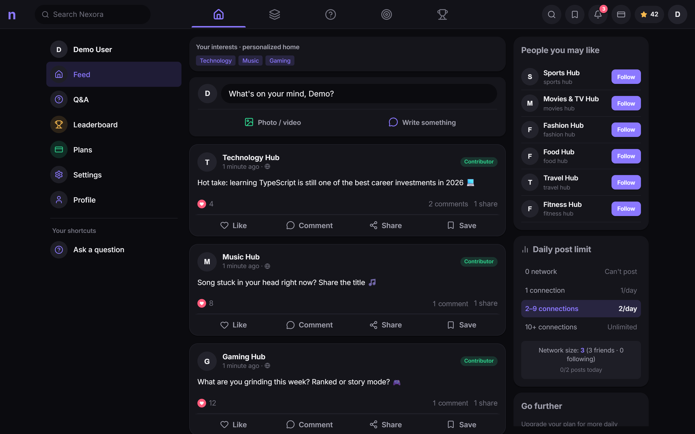
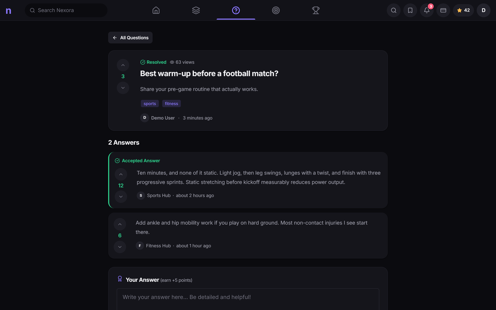
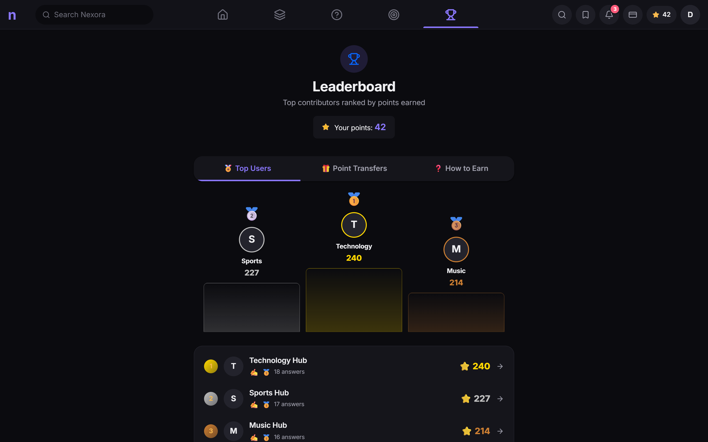
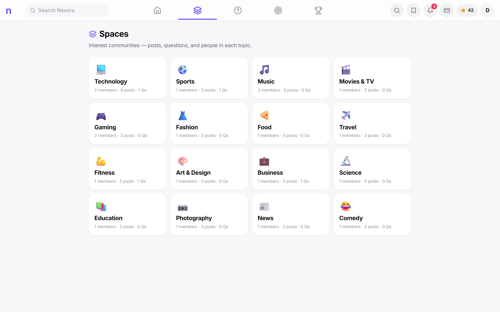
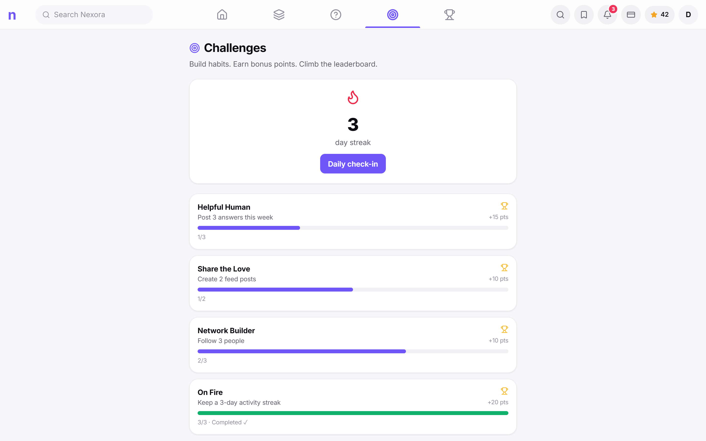
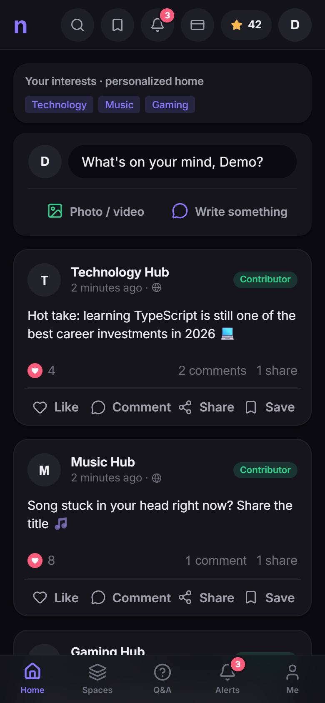
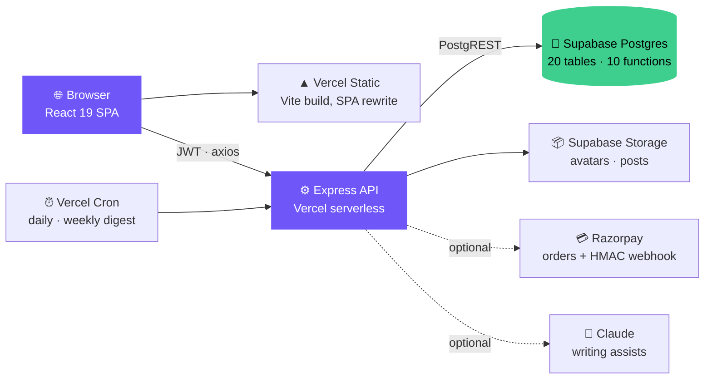

<div align="center">

# Nexora

### A social feed + Q&A platform where your reach is earned, not given.

[](https://client-olive-ten-89.vercel.app)
[](https://nexora-api-beta.vercel.app/api/health)


<br />



</div>

---

> ### One rule makes Nexora different
>
> **You can't post until you have a network.** Zero connections → zero posts per day. One connection unlocks 1/day. Two to nine unlocks 2/day. Ten or more is unlimited.
>
> Every other feed hands you a megaphone on day one and wonders why it fills with noise. Nexora makes you earn the room first.

---

## What it looks like

<table>
<tr>
<td width="50%"><br /><em>Q&A — upvotes, accepted answers, points for helping</em></td>
<td width="50%"><br /><em>Leaderboard — points, badges, transfers</em></td>
</tr>
<tr>
<td width="50%"><br /><em>Spaces — 16 interest communities, light theme</em></td>
<td width="50%"><br /><em>Challenges — weekly goals and activity streaks</em></td>
</tr>
</table>

<div align="center">

<br /><em>Responsive down to 390px, installable as a PWA</em>
</div>

---

## Run it in 30 seconds — no database needed

```bash
git clone https://github.com/vikramyadav1404/nexora.git
cd nexora && npm run install-all

cd server && DEMO_MODE=true npm start    # terminal 1
cd client && npm run dev                 # terminal 2
```

Open **http://localhost:5173** and log in with **`demo@nexora.com`** / **`demo1234`**.

Demo mode swaps the entire API for an in-memory store — same routes, same response shapes, seeded with content. Everything works except persistence.

---

## Architecture



---

## Engineering decisions

The parts that aren't obvious from the file tree.

**Auth is stateless but never stale.** No session store. Every protected request verifies the JWT *and* re-reads the user row, so a ban or role change takes effect on the very next request — no token revocation machinery needed.

**No ORM, and that's a deliberate trade.** Routes call PostgREST directly through `getSupabase()`. The API uses the `service_role` key, which bypasses Row Level Security — meaning **Express is the only access-control layer**, and every route does its own authorisation in JavaScript.

**The feed uses cursor pagination, not offsets.** `GET /api/posts` returns an opaque `nextCursor` encoding `(created_at, id)`. Offset pagination lets a new post shift rows across page boundaries mid-scroll, producing duplicates and gaps.

**Points transfer inside a Postgres function with row locks.** `transfer_points()` takes `FOR UPDATE` locks on both balances, so two concurrent requests can't double-spend the same points. There's a test that proves it.

**Payment verification never trusts the request body.** The plan is derived from the *stored* transaction, and the Razorpay HMAC is verified in constant time. The raw-body middleware is mounted *before* `express.json()` so the signature is computed over the exact bytes Razorpay sent.

**A half-authenticated login opens nothing.** With two-factor on, `/login` returns a token typed `mfa_pending` and sets no refresh cookie — no session exists until a code is verified. The type check lives in the `protect` middleware every route already uses, so a route added tomorrow is covered without anyone maintaining a list. TOTP is ~150 lines of `node:crypto` against the RFC 6238 vectors rather than a dependency, each code is single-use within its own 30-second window, and guessing is bounded by a per-account lockout rather than by the IP rate limiter — which is keyed by address and deliberately fails open.

**snake_case in, camelCase out.** Postgres columns are `snake_case`; the API contract is `camelCase`. The whole translation lives in `server/db/helpers.js`.

**Demo mode is a complete second backend.** `DEMO_MODE=true` replaces the entire `/api` surface with an in-memory store — same paths, same shapes. The client can't tell the difference.

**Features degrade instead of failing.** No `ANTHROPIC_API_KEY` → AI routes return 503 and the UI hides them. No search migrations → search falls back to `ILIKE`. Sharp unavailable → images store unoptimized. Nothing crashes because an optional key is absent.

---

## Stack

| Layer | Choices |
|---|---|
| **Frontend** | React 19 · Vite 8 · React Router 7 · Motion 12 · Embla · Lucide · Axios |
| **Styling** | ~2,100 lines of hand-written CSS. No framework. Custom properties + `data-theme` light/dark, resolved before first paint |
| **Backend** | Node 20 · Express 4 · JWT · bcrypt (cost 12) · Sharp · Multer · Helmet · Postgres-backed rate limiting |
| **Data** | Supabase Postgres via PostgREST — 20 tables, 10 functions, 21 indexes |
| **Services** | Razorpay payments · Anthropic Claude · Nodemailer · Supabase Storage & Realtime |
| **Infra** | Two Vercel projects (static SPA + serverless API) · Vercel Cron · GitHub Actions CI |
| **Tests** | Vitest + Supertest — 143 tests, no database required |

**By the numbers:** `22` pages · `93` REST endpoints across 18 route modules (plus a 57-endpoint in-memory mirror for demo mode) · `22` tables · `9` shared UI primitives · `8` custom hooks · `143` tests

---

## Features

**Social feed** — post text and images, like, comment, share, save. Personalised: posts from people you follow and topics you picked rank higher.

**Q&A** — ask, answer, upvote, accept. Your daily question allowance depends on your subscription tier.

**Spaces** — 16 interest communities. Onboarding picks your interests, auto-follows the relevant hubs, and seeds your feed so day one isn't empty.

**Points & rewards** — earn by answering, transfer to other users, unlock badges, climb the leaderboard.

**Subscriptions** — Bronze / Silver / Gold via Razorpay, each raising your daily question limit.

**AI assists** *(optional)* — Claude drafts an answer, rewrites a vague question, suggests tags, triages moderation reports.

**Account security** — 15-minute access tokens with rotating refresh tokens and theft detection, plus optional two-factor authentication (TOTP) with single-use backup codes.

**Safety** — block users, report content, admin moderation queue.

---

## Testing

```bash
cd server && npm test     # 143 tests, no DB — injects a fake Supabase client
```

Coverage is deliberately weighted toward what's expensive to get wrong:

- **Payment verification** — including a regression test that replays a real privilege-escalation attack and asserts it now fails
- **Points transfer under concurrency** — proves points can't be double-spent
- **Token rotation** — reuse of a rotated refresh token revokes the whole family
- **Two-factor** — RFC 6238 vectors, replay inside a code's own 30-second window, and the per-account lockout
- **Feed cursor pagination** — including the 60-post cap that used to truncate the feed
- **Search input escaping** — against PostgREST filter injection
- **Image pipeline** — resize caps, WebP conversion, corrupt-file handling

---

<details>
<summary><strong>Running against a real database</strong></summary>

<br />

1. Create a project at [supabase.com](https://supabase.com)
2. Build the setup script and run it in the **SQL Editor**:

```bash
cd server && npm run migration:runner -- --fresh --verify
```

   This concatenates every numbered migration in `server/db/migrations/` into one
   paste-ready file — 22 tables, 10 functions, every index — and appends a `SELECT`
   that confirms the objects were created. Open the file it names, copy all of it,
   paste into the SQL Editor, press Run.

   To apply only some migrations later, list them: `npm run migration:runner -- 008 009`

3. Copy `server/.env.example` → `server/.env`:

```env
DEMO_MODE=false
SUPABASE_URL=https://xxxx.supabase.co
SUPABASE_SERVICE_ROLE_KEY=...     # secret — server only, never the client
JWT_SECRET=<long random string>
CLIENT_URL=http://localhost:5173
```

4. `npm run dev` from the root starts both.

</details>

<details>
<summary><strong>Environment variables</strong></summary>

<br />

**Required** (server): `SUPABASE_URL`, `SUPABASE_SERVICE_ROLE_KEY`, `JWT_SECRET`, `CLIENT_URL`

**Optional** — each unlocks a feature, and the app runs fine without it:

| Variable | Unlocks |
|---|---|
| `ANTHROPIC_API_KEY` | AI answer drafting, question rewriting, auto-tagging, moderation triage |
| `SUPABASE_JWT_SECRET` | Live notification badge over Supabase Realtime |
| `RAZORPAY_KEY_ID` / `_SECRET` | Real payments (mock checkout without them) |
| `RAZORPAY_WEBHOOK_SECRET` | Recovers payments whose browser callback never lands |
| `CRON_SECRET` | Scheduled jobs |
| `SENTRY_DSN` | Error reporting |
| `USE_SUPABASE_STORAGE` | Cloud media storage instead of local disk |
| `EMAIL_USER` / `EMAIL_PASS` | Transactional email (Gmail app password) |

Client: `VITE_API_URL`, plus optionally `VITE_SUPABASE_URL` and `VITE_SUPABASE_ANON_KEY` for Realtime.

> **Never** put `SUPABASE_SERVICE_ROLE_KEY` in `client/.env`. It bypasses all database security. The client gets the `anon` key only.

</details>

<details>
<summary><strong>Project layout</strong></summary>

<br />

```
client/
  src/
    components/ui/     Shared primitives (Avatar, Sheet, Lightbox, SmartImage…)
    contexts/          AuthContext — the single source of session truth
    hooks/             useInfiniteScroll, useOptimistic, usePullToRefresh…
    pages/             22 route components, all lazy-loaded
    services/          axios instance, Supabase Realtime client
    styles/            index.css (tokens + components), primitives.css
server/
  db/
    migrations/        SQL files, run in order
    helpers.js         Row → API-shape translation
    demoStore.js       In-memory backend for DEMO_MODE
  middleware/          auth (JWT), admin, rateLimit
  routes/              17 modules, 79 endpoints
  utils/               claude, image, storage, email, respond, observability
  test/                Vitest suites
```

</details>

<details>
<summary><strong>Deployment</strong></summary>

<br />

Two Vercel projects from one repo.

**API** (`server/`) — Node serverless. Set the env vars above in the Vercel dashboard. `server/vercel.json` registers two cron jobs.

**Frontend** (`client/`) — static build with SPA rewrite. Set `VITE_API_URL` to the deployed API origin.

```bash
cd server && vercel --prod
cd client && vercel --prod
```

**Keeping the database alive:** free Supabase projects pause after ~1 week of inactivity. The daily cron job (`/api/cron/daily`) touches the database and prevents this.

</details>

<details>
<summary><strong>Security notes</strong></summary>

<br />

- Passwords bcrypt-hashed at cost 12; hashes never leave the server
- Payment verification derives the plan from the stored transaction and verifies the HMAC in constant time
- Point transfers run inside a Postgres function with row locks
- User input is escaped before reaching PostgREST filter strings
- Uploaded images have EXIF metadata stripped, removing GPS coordinates
- 500 responses return a generic message plus a request ID; the full error goes to the server log only
- Rate limits live in Postgres, so they survive serverless cold starts

**Caveat, stated plainly:** the API uses the `service_role` key, which bypasses Row Level Security. RLS is enabled on every table but is *not* the enforcement layer — Express is. Any new route must do its own authorisation.

</details>

---

## Status

Live and working. Some features ship dormant and switch on when their key is set.

Known gaps, honestly:

- **Video isn't transcoded.** Images are optimised; videos upload as-is, up to 50 MB.
- **No frontend tests.** The 143 tests cover the API only.
- **No direct messages.** The social graph supports friends and follows, but there's no messaging.

---

## License

MIT © Vikram Yadav
