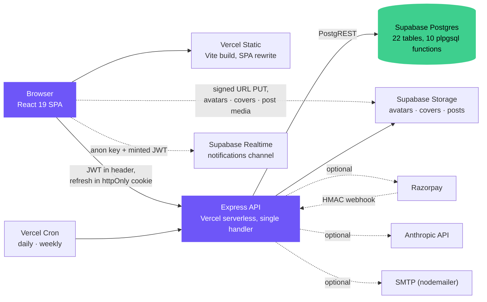

# Nexora

A social feed and Q&A platform built around one constraint: your daily posting allowance is a function of your network size, not your subscription. An account with no connections can post nothing; ten or more connections unlocks unlimited. The intent is to make consumption and participation precede broadcast, which is the inverse of how most feeds onboard. Everything else — Spaces, points, badges, subscriptions — exists to give that constraint something to sit on.

---

## Architecture



There is no Redis, no job queue, and no worker process. Scheduled work runs as authenticated HTTP endpoints hit by Vercel Cron (`server/routes/cron.js`); rate limiting is a Postgres table. Both choices are discussed below.

The whole API is one serverless handler — `server/vercel.json` routes `/(.*)` to `index.js`, which mounts every router on first invocation and caches the resulting app.

---

## Tech stack

| Layer | Choice |
|---|---|
| Language | JavaScript. CommonJS on the server, ESM on the client. No TypeScript anywhere |
| Frontend | React 19, Vite 8, React Router 7, Motion 12, Embla, Lucide, Axios |
| Styling | Hand-written CSS, custom properties, `data-theme` light/dark. No framework |
| Backend | Node, Express 4, `helmet`, `compression`, `express-rate-limit` |
| Data access | `@supabase/supabase-js` against PostgREST. **No ORM** — no Prisma, no Knex, no `pg` |
| Schema | Raw SQL, 13 numbered migrations in `server/db/migrations/` |
| Auth | `jsonwebtoken`, `bcryptjs` (cost 12), TOTP implemented against `node:crypto` |
| Media | `sharp` server-side, `multer` memory storage, Supabase Storage buckets |
| Optional services | Razorpay, Anthropic SDK, Nodemailer, Sentry (raw HTTP, no SDK) |
| Tests | Vitest + Supertest, 262 tests across 16 files, no database required |

**Counted from the code:** 94 REST endpoints across 18 route modules, plus a separate 59-endpoint in-memory mirror for demo mode. 22 pages, 19 of them lazy-loaded. 10 shared UI primitives, 8 custom hooks.

---

## Engineering decisions

The parts that took thought. Each one has a cost, listed.

### Short access tokens with rotating refresh tokens and reuse detection

`server/utils/tokens.js`

Access tokens live 15 minutes and are held in memory by the client — never `localStorage`. Longevity moves to a 30-day refresh token: 32 bytes of CSPRNG output in an `httpOnly; SameSite=Strict` cookie scoped to `/api/auth`, stored server-side only as a SHA-256 digest.

Every use rotates it, recording the successor in `replaced_by`. Presenting an already-rotated token means either the legitimate client or a thief is replaying one, and there is no way to tell which from the server — so the entire family is revoked and both parties are logged out.

SHA-256 rather than bcrypt for these specifically: the input is 32 bytes of random, so there is no low-entropy guess space for a slow KDF to defend, and bcrypt would add ~250ms to every refresh and silently truncate past 72 bytes. Backup codes, which are short and human-typed, do use bcrypt.

**Trade-off.** `SameSite=Strict` only works because the browser reaches the API same-origin through rewrites in `client/vercel.json`. Setting `VITE_API_URL` in production silently reintroduces a cross-site split — `.vercel.app` is on the Public Suffix List, so the cookie is never sent — and the only symptom is that every session dies after 15 minutes. That variable must stay empty in production.

### Keyset pagination, with ranking pushed into SQL

`server/routes/posts.js`, `server/db/migrations/006_feed.sql`

`GET /api/posts` returns an opaque cursor: base64url of `created_at|id`. The SQL tiebreaks on both columns, so a post arriving mid-scroll cannot shift rows across a page boundary and produce a duplicate or a gap — which offset pagination does by construction.

Ranking runs inside `feed_for_user`, scoring against `follows` and `interest_tags`. It is deliberately **bucketed by day and ranked within the bucket**, not sorted globally by score: a global sort lets one followed author's month-old post outrank everything from today, which makes the feed feel broken.

**Trade-off.** Ranking logic now lives in a plpgsql function rather than JavaScript — harder to unit test, and it has to be migrated rather than deployed. The route degrades to plain `created_at DESC` if the function is absent, which keeps a database missing migration 006 usable rather than broken.

### Point transfers are a database transaction, not application logic

`server/db/migrations/005_hardening.sql`

Transferring points was a read-modify-write across two `users` rows. Two concurrent requests both read the old balance and both write, so points could be spent twice. No amount of JavaScript retry logic closes that.

`transfer_points()` takes `FOR UPDATE` locks on both rows inside one transaction, with `ORDER BY id` in the lock step so two callers transferring in opposite directions acquire in the same sequence and cannot deadlock.

**Trade-off.** Business rules — the minimum balance floor, the self-transfer rejection — now live in SQL, where they are invisible to anyone reading the route. The route falls back to a non-atomic JS path if the function is missing, which is a correctness compromise made deliberately so a partially-migrated database still works.

### Subscriptions do not recur, and renewal stacking made that a trade-off

There is no recurring billing. A payment buys 30 days, no card is stored, and no
Razorpay subscription object exists — `getActivePlan()` in `db/helpers.js` simply
returns `free` once `subscription_expires_at` passes. Every subscription cancels
itself, so the plans page says so in as many words rather than offering a Cancel
button that implies a charge is coming.

`POST /subscriptions/cancel` exists anyway, for ending a plan early. It reports
`daysForfeited` because that is what the action actually costs: cancelling on day
2 of 30 gives up 28 paid days and there is no refund. Refunds are out of scope —
that is real money movement and needs a stated policy.

Renewal is where the interesting trade-off is. Activation used to compute
`now + PLAN_DAYS` flat, which silently discarded any remaining time; renewing on
day 20 lost 10 days, and the UI refused the action outright rather than fixing
it. Time now stacks from the existing expiry.

That flat value was load-bearing, though. Writing the same date twice lands on
the same date, so a double activation could not extend anything — the arithmetic
was itself an idempotency guarantee. Stacking removes it: one payment counted
twice would now hand out 60 days. This is only safe because activation already
refuses to run twice, via the `.eq('status', 'pending')` conditional claim and
migration 013's partial unique index on `razorpay_payment_id`. Those guards
carry more weight than they appear to, and
`test/subscriptionTrial.test.mjs` asserts the specific outcome: two callers, one
payment, 40 days rather than 70.

Switching plans deliberately does not stack — 10 days of Gold must not become 10
extra days of Bronze — so a different plan starts a fresh 30 days from today.

The 2-day trial needs its own column (`users.trial_used_at`, migration 014)
because subscription state cannot answer "has this account trialled before". An
expired trial leaves the user on `free`, which is indistinguishable from someone
who never trialled, and cancelling mid-trial looks the same again. The column is
never cleared, and the write is conditional on it being null so two simultaneous
requests cannot both grant a trial.

### Rate limiting in Postgres, and what that forces elsewhere

`server/middleware/rateLimit.js`

`express-rate-limit`'s default store is per-process memory. On serverless that is close to useless: every concurrent lambda holds its own counter and every cold start resets it, so the effective limit is multiplied by instance count. Counters live in a `rate_limits` table incremented through an atomic RPC instead.

Two properties matter. Each limiter namespaces its own keys — they previously shared one row keyed only by IP, so roughly ten page loads exhausted the hourly budget for password changes. And the store **fails open**: if Postgres is unreachable the request is allowed, because rate limiting is a mitigation and should not become an outage.

**Trade-off.** Failing open means it cannot be the last line of defence for anything. That is why two-factor verification carries its own per-account lockout in `server/utils/mfa.js` rather than relying on the IP limiter — a six-digit code against an attacker who already has the password needs a guarantee, not a mitigation.

### Uploads bypass the API entirely

`server/utils/postMedia.js`, `client/src/services/uploads.js`

A serverless function caps its request body at roughly 4.5MB. Media used to be posted as multipart through the API, so the composer's advertised 50MB was unreachable — an ordinary phone photo failed at the platform edge before any application code ran, with nothing useful to show the user.

The browser now asks for a signed URL, PUTs straight to Supabase Storage, and sends the API only an object key. Images are downscaled to 1600px WebP in the browser first, which the server used to do with sharp; a 23MB photo becomes about 850KB, so the upload is also far smaller than the original.

**Trade-off, and it is a real one.** A Supabase signed upload URL cannot carry `Content-Length` or `Content-Type` conditions the way an S3 presigned POST can. Between minting a ticket and attaching it, the client controls the bytes completely — so every check has to happen afterwards, against the stored object: ownership from the key prefix, real size from `statObject`, and the actual media type from a 32-byte ranged read rather than the declared MIME. A post is only ever created from an object that passed all of them.

What that does not prevent is the object landing in the bucket in the first place. Nothing in application code can. That is bounded by the bucket's own file size limit (currently 50MB on `posts`), a 10-per-hour presign limit, and the daily sweep that deletes objects never attached to a post.

### Demo mode is a second backend, not a flag

`server/routes/demo.js`, `server/db/demoStore.js`

With `DEMO_MODE=true`, `index.js` mounts an entirely separate router backed by an in-memory store — 59 endpoints mirroring the real surface, same paths, same response shapes, seeded with content. The client cannot tell the difference, and the app runs with no database at all.

**Trade-off.** It is a genuine second implementation, roughly 1,400 lines, and nothing structurally keeps it in step with the real routes. It has drifted before. It earns its place by making the project runnable in about thirty seconds by someone who will not create a Supabase project, and by giving tests a target that needs no network.

### No ORM, and what that implies for authorization

Routes call PostgREST directly through `getSupabase()`. The API holds the `service_role` key, which **bypasses Row Level Security**. RLS is enabled on every table, but it is not the enforcement layer — Express is. Every route does its own authorization in JavaScript, and any new route must too.

**Trade-off.** This is the riskiest decision in the codebase. It buys simplicity and one less abstraction over a schema that is already explicit SQL; it costs the safety net that would otherwise catch a route that forgets to scope a query by user. Column naming is `snake_case` in Postgres and `camelCase` over the wire, with the entire translation confined to `server/db/helpers.js`.

---

## Local setup

Requires Node 18+.

```bash
git clone https://github.com/vikramyadav1404/nexora.git
cd nexora
npm run install-all
```

### Without a database

```bash
cd server && DEMO_MODE=true npm start   # terminal 1
cd client && npm run dev                # terminal 2
```

`http://localhost:5173`, sign in as `demo@nexora.com` / `demo1234`. Everything works except persistence.

### Against Postgres

1. Create a project at supabase.com.
2. Build and run the schema:
   ```bash
   cd server && npm run migration:runner -- --fresh --verify
   ```
   That concatenates every numbered migration into one paste-ready file and appends a `SELECT` that confirms the objects exist. Paste it into the Supabase SQL Editor.
3. Copy `server/.env.example` to `server/.env`. Four variables are required — `SUPABASE_URL`, `SUPABASE_SERVICE_ROLE_KEY`, `JWT_SECRET`, `CLIENT_URL` — and `DEMO_MODE=false`.
4. `npm run dev` from the root runs both.

Fourteen further variables are optional, each gating one feature: `ANTHROPIC_API_KEY` (AI routes 503 without it), `SUPABASE_JWT_SECRET` (realtime notifications), `RAZORPAY_KEY_ID`/`_SECRET`/`_WEBHOOK_SECRET` (real payments; mock checkout otherwise), `MFA_SECRET_KEY` (encrypts stored TOTP secrets), `CRON_SECRET`, `USE_SUPABASE_STORAGE`, `EMAIL_USER`/`EMAIL_PASS`, `SENTRY_DSN`. Client-side: `VITE_API_URL` (must stay empty in production — see the auth section), `VITE_SUPABASE_URL`, `VITE_SUPABASE_ANON_KEY`.

Never put `SUPABASE_SERVICE_ROLE_KEY` in `client/.env`. The client gets the anon key only.

### Scripts

```bash
npm run dev            # root: api + client
npm run check          # root: lint + client build

cd server
npm test               # 262 tests, no database needed
npm run migration:runner -- 005 006   # build a paste-ready SQL file
npm run backup         # dump every table to backups/*.json
npm run smoke          # hit /api/ready and /api/health

cd client
npm run lint           # oxlint
```

---

## API surface

94 endpoints across 18 modules, all under `/api`. Roughly:

| Group | Count | Covers |
|---|---|---|
| `users` | 19 | profile, friends, follows, interests, profile media attach |
| `auth` | 18 | register, login, refresh, logout, two-factor, password recovery |
| `admin` · `posts` | 6 each | moderation queue and user actions; feed CRUD, likes, comments |
| `ai` · `questions` · `subscriptions` · `cron` | 5 each | Claude-backed assists; Q&A; Razorpay + webhook; scheduled jobs |
| `answers` · `safety` | 4 each | answers and voting; blocks and reports |
| `bookmarks` · `notifications` · `rewards` | 3 each | saved items; notification feed; points and leaderboard |
| `challenges` · `spaces` | 2 each | weekly goals; the 16 interest communities |
| `digests` · `search` · `uploads` | 1 each | weekly digest; global search; signed upload tickets |

A separate 59-endpoint mirror in `server/routes/demo.js` shadows this surface when `DEMO_MODE=true`.

---

## Testing

```bash
cd server && npm test
```

262 tests, 16 files, no database — the suite injects a fake PostgREST client (`server/test/helpers/fakeSupabase.js`) that also stubs Storage. Coverage is weighted toward things that are expensive to get wrong rather than toward line count:

- **Payments** — a regression test replays the privilege-escalation attack that used to work (a client-supplied `isMock` flag skipping signature verification) and asserts it now fails.
- **Two-factor** — all six RFC 6238 vectors including `T=20000000000`, which catches a counter written as 32-bit; replay of a code inside its own 30-second window; the per-account lockout.
- **Query counts** — `GET /api/bookmarks` and `GET /api/spaces/:id` are asserted to issue the same number of queries for 20 rows as for 1. Response-shape tests pass just as happily against an N+1, which is how one survived two cleanup passes unnoticed.
- **Token rotation** — reuse of a rotated refresh token revokes the whole family.
- **Error contract** — the underlying Postgres text never reaches the response; the dev-only `detail` field stays absent unless `NODE_ENV` is exactly `development`.

There are no frontend tests.

---

## Known gaps

Stated rather than omitted.

- **Search returns at most 50 results per type, and cannot page past that.** `search_questions`, `search_posts` and `search_people` all end in `LIMIT LEAST(GREATEST(p_limit, 1), 50)`. Ranked results have no usable cursor either — rank is not monotonic with time, so the `created_at` keyset the feed uses does not apply. Paging deeper needs a signature change.
- **A query that is only a typo finds nothing.** `search_questions` and `search_posts` filter on `search_vector @@ websearch_to_tsquery(...)` before ranking, so trigram similarity can only reorder results that full-text search already matched — it cannot surface one on its own. A query of nothing but stopwords produces an empty tsquery and matches nothing, by the same mechanism.
- **The people search in `server/routes/users.js` still uses `ILIKE '%q%'`,** which no index can serve because of the leading wildcard. `/api/search` no longer does.
- **`storage_key` is not recorded until migration 011 is applied.** The insert falls back to omitting the column and logs a warning once, so posting still works — but until 011 runs, uploaded objects cannot be swept or deleted alongside their post. Rows written before 011, and any written by the multipart path, keep an empty key permanently.
- **`audit_logs` is defined in `004_production.sql` but does not exist in the database** — 004 was never applied. Nothing writes to it either. Migration 012 re-states the rest of 004 and deliberately leaves this table out.
- **Video is stored, never transcoded.** `server/utils/image.js` optimises images to WebP and passes video through untouched.
- **Demo mode can drift** from the real routes, as described above.
- **No frontend tests.**

---

## License

MIT
