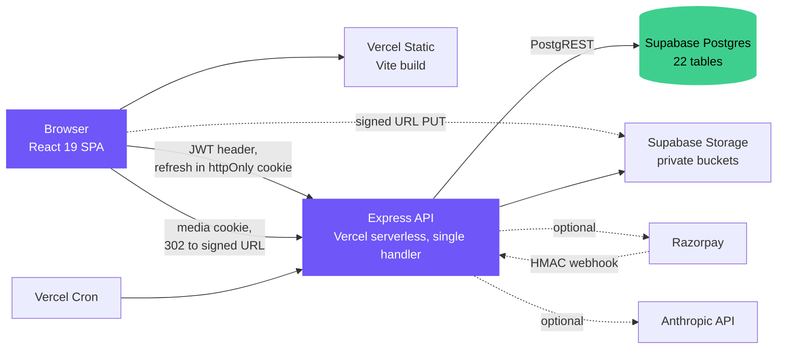

# Nexora

A social feed and Q&A platform built around one constraint: your daily posting allowance is a function of your network size, not your subscription. An account with no connections can post nothing; ten or more connections unlocks unlimited. Consumption and participation precede broadcast, the inverse of how most feeds onboard. Everything else — Spaces, points, subscriptions — gives that constraint something to sit on.

---

## Architecture



No Redis, no job queue, no worker. Scheduled work is authenticated HTTP endpoints hit by Vercel Cron; rate limiting is a Postgres table. The whole API is one serverless handler that mounts every router on first invocation and caches the app.

| Layer | Choice |
|---|---|
| Language | JavaScript. CommonJS server, ESM client. No TypeScript |
| Frontend | React 19, Vite 8, React Router 7, Motion 12, Axios |
| Styling | Hand-written CSS, custom properties, `data-theme` light/dark |
| Backend | Node, Express 4, helmet, express-rate-limit |
| Data access | `@supabase/supabase-js` against PostgREST. **No ORM** |
| Schema | Raw SQL, 20 numbered migrations |
| Auth | `jsonwebtoken`, `bcryptjs`, TOTP against `node:crypto` |
| Tests | Vitest + Supertest. 469 server (29 files), 44 client (3 files) |

95 REST endpoints across 19 route modules, plus a 59-endpoint in-memory mirror for demo mode. 22 pages.

---

## Implemented vs planned

| | Status |
|---|---|
| Feed, posts, comments, likes, bookmarks | Implemented |
| Q&A: questions, answers, voting, accepted answers | Implemented |
| Network-size posting quota | Implemented — Postgres row lock |
| Points, badges, transfers | Implemented — transfer is a DB transaction, not app logic |
| Two-factor auth (TOTP + backup codes) | Implemented — hand-rolled, all six RFC 6238 vectors tested |
| Email verification | Implemented, and now enforced on three actions |
| Subscriptions and checkout | Implemented, **but nothing recurs** — payments add days |
| Search, ranked in SQL | Implemented — **capped at 50 results, cannot page past it** |
| Media upload and serving | Implemented — direct-to-storage PUT, authorising redirect on read |
| AI assists | Implemented, optional — no-ops without `ANTHROPIC_API_KEY` |
| Weekly digest email | Implemented, optional — no-ops without SMTP |
| Realtime notifications | Implemented via Supabase Realtime |
| Video transcoding | **Not built.** Video is stored and served untouched |
| `audit_logs` | **Not built.** Defined in `004_production.sql`, never applied. Nothing writes to it |
| Cron dry-run mode | **Not built.** Considered after the deletion bug below; recorded rather than implied |
| Frontend tests | **Mount-level only.** Every route is smoke-tested against fixtures; no behavioural coverage |

---

## The security work

Eight findings. What was wrong, why it mattered, what it is now.

The two that changed how the project works are written up in [docs/decisions/](docs/decisions/), and [what a month of audits found](docs/retrospective-2026-08.md) covers the pattern underneath all of them.

**The service-role key was reachable from the browser bundle.** That key bypasses row-level security entirely: it is the database, with no policy in front of it. Inlined into the client build, it hands every visitor full database control. Moved server-side, and made unrepeatable: `client/scripts/check-env.js` fails `npm run build` on any `VITE_`-prefixed variable holding a `service_role` JWT or a secret-shaped name. A convention nothing enforces gets broken on the next hurried deploy.

**JWT verification fell back to a hardcoded secret.** `jwtSecret()` returned `'dev_insecure_jwt'` when `JWT_SECRET` was unset. The value is in the source, so anyone who read the repo could mint a token for any user id — account takeover with no credentials, and indistinguishable from a real login in the logs. It was a development convenience, which is how such things reach production: it never fails, so nothing tells you the real secret is missing. Now it throws, and a boot assertion requires 32+ characters.

**CORS allowed any `*.vercel.app` origin with credentials.** Anyone can deploy to `attacker-anything.vercel.app`, which let an arbitrary site read authenticated responses for a logged-in visitor. Confirmed against production first: an unrelated `.vercel.app` origin came back echoed in `Access-Control-Allow-Origin`. Now an exact allowlist, localhost only outside production, plus an explicit escape hatch — so the next origin is added deliberately rather than by widening a pattern.

**The nightly cron would have deleted every attachment.** The worst of the eight, and it was live. Two faults. The kind map was `kind === 'avatar' ? 'avatar_key' : 'cover_key'` — correct for exactly as long as there were two kinds. A third, `post`, was added later; the ternary silently answered `cover_key`, so the sweep compared post objects against cover keys, matched nothing *by construction*, and judged every attachment an orphan. Separately, the query loading live keys discarded its error — one statement timeout returned an empty set, read as "nothing is referenced", deleting every avatar and cover. One shape twice: a failure to read data treated as data. The kind map is now explicit, so an unmapped kind makes the sweep **skip** that bucket, and the key load throws rather than returning a partial set. Skipping leaks orphans; guessing deletes live files; only one is recoverable.

**Storage buckets were public.** Every avatar, cover and attachment was retrievable by anyone with the URL — no session, no authorisation — and keys are guessable enough to enumerate. Private posts were not private. Blast radius was established before the fix, not after: flipping a bucket private **invalidates every existing public URL**, so anything already shared stops working. Reads now go through `GET /api/media/:bucket/*`, which authorises the viewer, checks ownership and post visibility, then 302s to a 60-second signed URL. It refuses `Authorization` headers deliberately — the only client that matters is an ``, which cannot send one. Authorisation rides on a dedicated cookie, `SameSite=Lax` not `Strict`, since `Strict` is never sent on subresource loads.

**The error handler echoed the database.** It returned `err.message` verbatim, which for a PostgREST failure is raw schema — table, column and constraint names — handed to whoever triggered the error. It looked unreachable, since `asyncHandler` sanitises; but 15 routes are unwrapped and land in the global handler directly, so fixing only the wrapped path would have repeated the partial coverage that caused the bug. Both handlers now share one responder, and the regression test uses an **unwrapped** route — one going through `asyncHandler` would have passed with the leak intact.

**`POST /api/auth/generate-password` was unauthenticated and unlimited.** A pre-login endpoint doing real work with no rate limit: free CPU, and a way to confirm the API is up and unthrottled. It now carries the same limiter as the other pre-auth endpoints. `protect` is not an option — the forgot-password screen calls it before login.

**`email_verified` was set at registration and enforced nowhere.** One consumer in the whole codebase — the weekly digest filter. Making it mean something needed the backfill first — 29 accounts, 1 verified, so a gate without grandfathering is a 96% lockout: an outage, not a fix. Migration `018` grandfathered the 28 with a **hardcoded cutoff**, because the obvious `WHERE email_verified = false` would, re-run later, silently grandfather every account created since — switching the gate off for exactly the accounts it exists to catch. The gate covers three actions with a concrete cost: transfers (economic value), reports (a human's attention), AI routes (real money per call). Not gated: login, posting, payments, blocking — the last has a test keeping it open, since the people most likely to need it are new accounts.

---

## What's still open

- **No integration test covers the URL the API actually returns.** Found the hard way. Avatars 401'd in production for four rounds of investigation while every check passed, because `publicAssetUrl` prepended an absolute host — derived from `VERCEL_URL`, so a different one per deploy — to the relative `/api/media/` paths migration 017 had just created. Cross-origin means the host-scoped cookie is not sent, and an `` cannot send an `Authorization` header instead. Every check read the *database* value and requested it directly: the database, the route and the cookie were each correct, and the seam between them was not. Fixed, with tests asserting on serialiser output under the environment conditions production actually has. The lesson generalises past this bug — probing components individually cannot find a fault that lives between them, and a green suite against a failing browser means the suite is blind, not that the browser is odd.
- **Search cannot page past 50.** Rank is not monotonic with time, so the keyset the feed uses does not apply.
- **A query that is only a typo finds nothing** — trigram similarity reorders full-text matches but cannot surface one alone.
- **`storage_key` is empty** for rows written before migration 011 and by the multipart path; those objects can never be swept.
- **`audit_logs` does not exist** and nothing writes to it.
- **Video is stored, never transcoded.**
- **Demo mode is a second implementation** of 59 endpoints and will drift.

## What I would do next

1. **A staging environment.** The bucket flip and media proxy were verified against production because there is nowhere else. Every incident here was found by audit or in production — none before deploy.
2. **Behavioural coverage for the client.** Every route now has a mount smoke test, which closes the class that reached production — a page-level `ReferenceError` nothing looked for. What is still uncovered is behaviour: the session, the refresh cycle, media recovery, and anything that only breaks after an interaction.
3. **Delete demo mode or generate it.** Two hand-maintained implementations of 59 endpoints will diverge; the only question is when.
4. **A dry-run flag on the destructive cron.** It has caused two near-total data losses and cannot say what it would delete without deleting it.
5. **Decide on recurring billing.** Subscriptions that silently do not renew are a product decision being made by omission.

---

## Local setup

```bash
npm run install-all
cp server/.env.example server/.env   # Supabase URL + keys, JWT_SECRET (32+ chars)
npm run dev                          # server :5000, client :5173
```

No database? Set `DEMO_MODE=true` in `server/.env` — the in-memory mirror serves a working app with seeded data. Otherwise apply `server/db/migrations/*.sql` in numeric order.

```bash
cd server && npm test                # 469 tests, no database required
cd client && npm test                # 44 tests, incl. a mount smoke test for every route
cd server && npm run check:buckets   # fails if any bucket is publicly readable
cd client && npm run check:env       # fails if a secret is exposed to the build
```

The server suite injects a fake PostgREST client that also stubs Storage, so nothing touches a real database. Coverage is weighted toward what is expensive to get wrong: payment signature verification, TOTP vectors, refresh-token rotation and reuse detection, query counts asserted flat against N+1, and the error contract. Each guard was mutation-checked — remove it, confirm its test goes red.

---

## License

MIT
